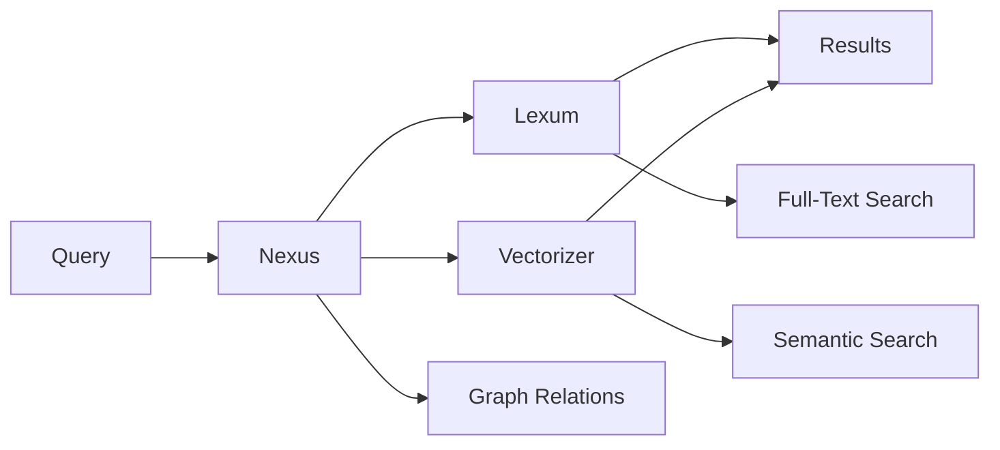

# VRPG Client - Integração MCP Services

## Visão Geral

O VRPG Client integra múltiplos **MCP Services** (Model Context Protocol) para criar um ecossistema de IA avançado, oferecendo conversação multi-modelo, busca semântica inteligente e compressão de prompts.

## Status do Sistema MCP

**Data**: 2025-11-22  
**Status**: ✅ TODOS OS SERVIDORES MCP FUNCIONANDO

### Servidores MCP Ativos

#### 1. Context7
- **Status**: ✅ Conectado
- **Tools**: 2 enabled
- **Função**: Library documentation, code examples
- **Protocolo**: MCP nativo

#### 2. Vectorizer-main  
- **Status**: ✅ Conectado
- **Tools**: 20 enabled
- **Função**: Semantic search, collections, document indexing
- **Protocolo**: MCP nativo
- **Porta**: 15002
- **Docker Image**: `hivehub/vectorizer:latest` ([Docker Hub](https://hub.docker.com/r/hivehub/vectorizer))
- **Localização**: `G:\vrpg\vectorizer-feature-native-engine-optimization` (desenvolvimento local)

#### 3. Synap (via Bridge HTTP)
- **Status**: ✅ Conectado  
- **Tools**: 3 enabled
- **Função**: KV operations, queue management, pub/sub, **Model Communication Hub**
- **Protocolo**: StreamableHTTP (via bridge)
- **Porta**: 15500
- **Bridge**: `G:\vrpg\vrpg-client\synap-http-bridge.py`

**Arquitetura de Comunicação Unificada**: Todas as comunicações entre modelos AI (ASR, TTS, LLM) passam pelo Synap. Ver seção [Comunicação Unificada via Synap](#comunicação-unificada-via-synap) abaixo.

### Gerenciamento de Servidores

**Executável Principal**:
```bash
# Iniciar todos os servidores
.\servers.exe

# Verificar status
.\servers.exe --status

# Parar servidores  
.\servers.exe --stop
```

**Arquivos de Controle**:
- `servers.exe` - Executável principal
- `servers.bat` - Script batch com lógica inteligente
- `ServersLauncher.cs` - Wrapper C# 
- `synap-mcp-simple.py` - Bridge MCP para Synap
- `vectorizer-mcp.py` - Bridge MCP para Vectorizer
- `context7-mcp.py` - Bridge MCP para Context7
- `mcp_servers.json` - Configuração dos servidores MCP no Cursor

### Solução Técnica - Synap Bridge

**Problema Original**: O Synap não tinha suporte nativo para o comando `mcp.list_tools` que o Cursor precisava via StreamableHTTP.

**Solução Implementada**:
1. Bridge HTTP na porta 15500
2. Intercepta comandos MCP (`mcp.list_tools`)
3. Retorna lista de ferramentas em formato MCP
4. Redireciona outros comandos para Synap real (se necessário)

**Código do Bridge**: `G:\vrpg\vrpg-client\synap-http-bridge.py` (porta 15500, health: `http://127.0.0.1:15500/health`)

### Troubleshooting

**Se Synap mostrar "Loading tools"**:
1. Verificar se `synap-http-bridge.py` está rodando na porta 15500
2. Testar health check: `http://127.0.0.1:15500/health`
3. Reiniciar bridge: `python synap-http-bridge.py`

**Se Vectorizer não conectar**:
1. Verificar se está rodando na porta 15002
2. Verificar se `cmake` e `NASM` estão no PATH
3. Recompilar: `cargo build --release --bin vectorizer`

## Serviços MCP Integrados

## Comunicação Unificada via Synap

**TODAS as comunicações entre modelos AI devem passar pelo Synap.**

O Synap atua como intermediário centralizado para:
- **ASR (Whisper)**: Transcrição de áudio
- **TTS (XTTS)**: Síntese de voz
- **LLM (Qwen)**: Geração de texto
- **SoVITS**: Conversão de voz

### Benefícios

1. **Unificação**: Uma única interface para todos os modelos
2. **Roteamento**: Synap roteia requisições para modelos apropriados
3. **Fila**: Suporte a filas para processamento assíncrono
4. **Cache**: Cache centralizado via KV store
5. **Coordenação**: Coordenação entre múltiplos modelos
6. **Observabilidade**: Logs e métricas centralizados

### Estrutura de Comunicação

```
┌─────────────┐
│ Orchestrator│
└──────┬──────┘
       │
       ▼
┌─────────────────────────────────┐
│      Synap Client               │
│  (Unified Model Interface)      │
└──────┬──────────────────────────┘
       │
       ├──► ASR (Whisper)
       ├──► TTS (XTTS)
       ├──► LLM (Qwen)
       └──► SoVITS
```

### Implementação

**Cliente Synap Centralizado**: `src/orchestrator/src/services/synap_client.rs`

**Métodos**:
- `transcribe_audio()` - ASR via Synap
- `synthesize_speech()` - TTS via Synap
- `generate_text()` - LLM via Synap
- `health_check()` - Verificar status do Synap

### Formato de Requisição

Todas as requisições usam StreamableHTTP:

```json
{
  "command": "asr.transcribe",
  "request_id": "req-1234567890",
  "payload": {
    "operation": "asr.transcribe",
    "audio_data": [...],
    "sample_rate": 16000,
    "language": "auto",
    "model": "whisper-large-v3",
    "use_gpu": true
  }
}
```

### Status da Migração

- ✅ **SynapClient centralizado**: Criado
- ✅ **LLM Core**: Migrado para Synap
- ⏳ **ASR Service**: Migrar para usar Synap
- ⏳ **TTS Service**: Migrar para usar Synap
- ⏳ **Orchestrator**: Atualizar para usar SynapClient exclusivamente

### Configuração

```bash
SYNAP_ENDPOINT=http://localhost:15500
SYNAP_API_KEY=synap_your-api-key-here
VRPG_ASR_USE_GPU=true
VRPG_TTS_USE_GPU=true
VRPG_LLM_USE_GPU=true
VRPG_LLM_MODEL_1_5B=qwen2.5-1.5b-instruct
VRPG_LLM_MODEL_14B=qwen2.5-14b-instruct
VRPG_LLM_PIPELINE=dual_model
```

---

### 1. Synap - Conversação Multi-Modelo
**Função**: Orquestração de diálogos entre Mestre IA, NPCs e Jogadores IA  
**Endpoint**: `http://localhost:15500` (via SynapClient)  
**Integração**: `src/orchestrator/src/services/synap_client.rs`

#### Casos de Uso
- **Diálogos Complexos**: Conversas entre múltiplos NPCs
- **Negociações**: Interações diplomáticas elaboradas
- **Combate Narrativo**: Coordenação entre inimigos
- **Roleplay Avançado**: Jogadores IA com personalidades distintas

#### Configuração
```json
{
  "synap": {
    "endpoint": "http://localhost:8001",
    "api_key": "${SYNAP_API_KEY}",
    "timeout": 5000,
    "max_participants": 8,
    "conversation_memory": 50
  }
}
```

#### Exemplo de Uso
```rust
use synap_client::SynapClient;

let conversation = SynapConversation::new()
    .add_participant("dm", "dungeon_master", Some("wise_narrator"))
    .add_participant("npc_wizard", "npc", Some("old_wise_mentor"))
    .add_participant("npc_rogue", "npc", Some("sarcastic_thief"))
    .set_context("tavern_negotiation", 0.7);

let response = synap_client.orchestrate_dialogue(
    conversation,
    "The party wants to negotiate safe passage through the wizard's tower"
).await?;
```

### 2. Transmutation - Conversão de Documentos
**Função**: Conversão de documentos para Markdown antes do processamento  
**Biblioteca**: `transmutation` (Rust crate)  
**Integração**: `src/memory-service/transmutation_integration.rs`

#### Formatos Suportados
- **Documentos**: PDF, DOCX, XLSX, PPTX, HTML, XML, TXT, CSV, RTF, ODT
- **Imagens**: JPG, PNG, TIFF, BMP, GIF, WEBP (com OCR)
- **Áudio/Vídeo**: MP3, WAV, M4A, FLAC, OGG, MP4, AVI, MKV, MOV, WEBM
- **Arquivos**: ZIP, TAR, GZ, 7Z

### 3. Classify - Classificação Inteligente
**Função**: Categorização automática de memórias e eventos  
**Endpoint**: `http://localhost:8003`  
**Integração**: `src/memory-service/classify_integration.rs`

#### Pipeline de Processamento Completo
```
Input Document → Transmutation → Markdown → Classify → Categories + Metadata → Vectorizer
```

#### Categorias Suportadas
- **event**: Eventos importantes da campanha
- **npc_relationship**: Relações com NPCs
- **location**: Informações sobre locais
- **favor_owed**: Favores e dívidas
- **quest**: Missões e objetivos
- **lore**: Conhecimento do mundo
- **combat**: Eventos de combate
- **treasure**: Tesouros e recompensas

#### Exemplo de Classificação
```json
{
  "input": "The party saved the old wizard Gandros from the collapsing tower in the Whispering Woods",
  "output": {
    "categories": [
      "event",
      "npc_relationship", 
      "location",
      "favor_owed"
    ],
    "confidence": 0.94,
    "metadata": {
      "importance": "high",
      "emotional_weight": 0.8,
      "npcs": ["gandros"],
      "locations": ["whispering_woods", "tower"],
      "favor_type": "life_debt"
    }
  }
}
```

#### Exemplo de Conversão de Documentos
```rust
use transmutation::{Converter, OutputFormat, ConversionOptions};

// Converter PDF para Markdown
let converter = Converter::new()?;
let result = converter
    .convert("campaign_notes.pdf")
    .to(OutputFormat::Markdown)
    .with_options(ConversionOptions {
        optimize_for_llm: true,
        max_chunk_size: 512,
        normalize_whitespace: true,
        ..Default::default()
    })
    .execute()
    .await?;

let markdown_content = result.content();
```

### 4. Nexus - Graph Database
- **Status**: ✅ Disponível
- **Função**: Graph relations, query enhancement, KNN traversal
- **Protocolo**: HTTP REST + MCP
- **Porta**: 15474
- **Repositório**: [hivellm/nexus](https://github.com/hivellm/nexus)
- **Localização**: `G:\vrpg\nexus-main` (desenvolvimento local)

### 5. Nexus + Lexum + Vectorizer - Busca Semântica
**Função**: Pipeline avançado de busca e recuperação de informações usando o stack Hive completo  
**Endpoints**: 
- Nexus: `http://localhost:8004`
- Lexum: `http://localhost:8005`  
- Vectorizer: `http://localhost:8002`

**Nota**: O stack Hive utiliza **Lexum** (não Lexus) para full-text search otimizado.

#### Fluxo de Busca


#### Nexus - Graph Relations e Query Enhancement
- **Graph Relations**: Relações de grafo entre entidades (NPCs, locais, eventos)
- **Graph Traversal**: Navega relações de grafo para encontrar entidades relacionadas
- **Expansão de Consultas**: Adiciona termos relacionados baseados em relações de grafo
- **Contexto Temporal**: Considera período da campanha e eventos recentes
- **Relevância Dinâmica**: Ajusta pesos baseado na sessão atual e relacionamentos

#### Lexum - Full-Text Search  
- **Busca Textual Otimizada**: Busca rápida de termos específicos
- **Indexação Full-Text**: Índices otimizados para busca textual
- **Performance**: Busca textual de alta performance
- **Integração**: Complementa busca semântica do Vectorizer com busca textual

#### Vectorizer - Vector Search
- **Busca Vetorial**: Similaridade semântica avançada
- **Índices Múltiplos**: Separação por escopo (global/campaign/session)
- **Ranking Inteligente**: Pontuação baseada em relevância e recência
- **Caching**: Cache de consultas frequentes

#### Vectorizer - Vector Search
- **Busca Vetorial**: Similaridade semântica avançada
- **Índices Múltiplos**: Separação por escopo (global/campaign/session)
- **Ranking Inteligente**: Pontuação baseada em relevância e recência
- **Caching**: Cache de consultas frequentes

#### Exemplo de Busca Completa
```rust
let search_request = SearchRequest {
    query: "What does the wizard owe us?",
    scope: vec!["campaign", "session"],
    session_id: "sess_123",
    max_results: 10,
    min_score: 0.7,
};

// Nexus: Expande query
let enhanced_query = nexus_client.enhance_query(&search_request).await?;
// "What does the wizard owe us?" → "wizard debt favor obligation gandros tower rescue"

// Nexus: Processa relações de grafo
let graph_query = nexus_client.process_graph(&enhanced_query).await?;
// Adiciona contexto: NPCs conhecidos, eventos recentes, relações

// Lexum: Busca textual otimizada
let text_results = lexum_client.fulltext_search(&graph_query).await?;

// Vectorizer: Busca vetorial semântica
let results = vectorizer_client.search(&graph_query).await?;
```

### 5. LessTokens - Compressão de Prompts
**Função**: Compressão inteligente para APIs externas  
**Integração**: `src/llm-core/compression/`  
**Biblioteca**: `semantic-compressor` (Rust)

#### Objetivos
- **Redução de Custos**: Comprimir prompts longos antes de enviar para APIs LLM externas
- **Performance**: Reduzir latência de chamadas API com payloads menores
- **Qualidade**: Manter similaridade semântica ≥ 93% com o texto original
- **Flexibilidade**: Suporte automático para português e inglês
- **Fallback**: Modo offline-first com fallback para APIs quando necessário

#### Arquitetura de Integração
```
llm-core/
├── src/
│   ├── compression/         # Módulo LessTokens
│   │   ├── mod.rs
│   │   ├── compressor.rs
│   │   ├── api_client.rs
│   │   └── config.rs
│   ├── local_llm.rs         # LLM local (GGUF)
│   ├── api_llm.rs          # LLM via API com compressão
│   └── router.rs           # Roteador local/API
└── Cargo.toml              # + semantic-compressor dependency
```

#### Modos de Compressão
- **Raw**: Texto original (< 800 tokens)
- **Lexicon**: Dicionário + stream básico
- **LexiconPro**: Compressão agressiva com RLE
- **LexiconGraph**: Modo semântico com grafo

#### Modos de Operação
- **LocalOnly**: Sempre usar LLM local
- **LocalFirst**: Usar API apenas como fallback
- **Hybrid**: Usar API quando mais eficiente
- **ApiOnly**: Sempre usar API (com compressão)

#### Pipeline de Decisão
```rust
let compression_result = match token_count {
    n if n < 800 => CompressionMode::Raw,
    n if n < 1500 && ttr <= 0.25 => CompressionMode::Lexicon,
    n if n < 3000 && ttr <= 0.25 => CompressionMode::LexiconPro,
    _ if semantic_task => CompressionMode::LexiconGraph,
    _ => CompressionMode::LexiconPro,
};
```

#### Exemplo de Compressão
```json
{
  "original_tokens": 2500,
  "compressed_tokens": 1650,
  "compression_ratio": 0.66,
  "similarity": 0.94,
  "method": "LexiconPro",
  "payload": {
    "format": "lexicon+stream@v1",
    "lexicon": { "0": "tavern", "1": "wizard", "2": "party" },
    "stream": "0 1 2 saved tower collapse favor owed",
    "metadata": { "rle_enabled": true, "delta_encoding": false }
  }
}
```

## Integração Arquitetural

### Configuração Centralizada
```yaml
# config/mcp.yml
mcp_services:
  synap:
    endpoint: "http://localhost:8001"
    timeout: 5000
    retry_attempts: 3
    
  classify:
    endpoint: "http://localhost:8003"
    batch_size: 10
    confidence_threshold: 0.8
    
  nexus:
    endpoint: "http://localhost:8004"
    query_expansion: true
    spell_check: true
    
  lexum:
    endpoint: "http://localhost:8005"
    fulltext_optimization: true
    index_optimization: "high"
    
  vectorizer:
    endpoint: "http://localhost:8002"
    index_name: "vrpg_memories"
    embedding_model: "all-MiniLM-L6-v2"
    
  lesstokens:
    enabled: true
    min_tokens_threshold: 800
    target_ratio: 0.65
    min_similarity: 0.93
```

### Client Abstractions
```rust
// src/mcp/client.rs
pub struct McpClientManager {
    transmutation: TransmutationConverter,
    synap: SynapClient,
    classify: ClassifyClient,
    nexus: NexusClient,
    lexum: LexumClient,
    vectorizer: VectorizerClient,
    config: McpConfig,
}

impl McpClientManager {
    pub async fn orchestrate_document_storage(&self, file_path: &str) -> Result<()> {
        // 1. Convert document to Markdown
        let markdown = self.transmutation.convert_to_markdown(file_path).await?;
        
        // 2. Classify the content
        let classification = self.classify.classify_text(&markdown).await?;
        
        // 3. Store in Vectorizer with metadata
        let memory = Memory {
            text: markdown,
            categories: classification.categories,
            metadata: classification.metadata,
            source_file: Some(file_path.to_string()),
            timestamp: Utc::now(),
        };
        
        self.vectorizer.insert_memory(memory).await?;
        Ok(())
    }
    
    pub async fn orchestrate_memory_storage(&self, text: &str) -> Result<()> {
        // For plain text (already in markdown/text format)
        // 1. Classify
        let classification = self.classify.classify_text(text).await?;
        
        // 2. Store in Vectorizer with metadata
        let memory = Memory {
            text: text.to_string(),
            categories: classification.categories,
            metadata: classification.metadata,
            source_file: None,
            timestamp: Utc::now(),
        };
        
        self.vectorizer.insert_memory(memory).await?;
        Ok(())
    }
    
    pub async fn enhanced_search(&self, query: &str) -> Result<Vec<SearchResult>> {
        // 1. Nexus: Enhance query with graph relations
        let graph_query = self.nexus.enhance_query(query).await?;
        
        // 2. Lexum: Full-text search
        let text_results = self.lexum.fulltext_search(&graph_query).await?;
        
        // 3. Vectorizer: Semantic search
        let semantic_results = self.vectorizer.search(&graph_query).await?;
        
        // 4. Combine and rank results
        let results = self.combine_results(text_results, semantic_results).await?;
        
        Ok(results)
    }
}
```

### Error Handling e Fallbacks
```rust
pub enum McpError {
    ServiceUnavailable(String),
    TimeoutError(String),
    AuthenticationError(String),
    RateLimitExceeded(String),
    InvalidResponse(String),
}

impl McpClientManager {
    async fn with_fallback<T, F, Fut>(&self, primary: F, fallback: T) -> Result<T>
    where
        F: FnOnce() -> Fut,
        Fut: Future<Output = Result<T>>,
    {
        match primary().await {
            Ok(result) => Ok(result),
            Err(McpError::ServiceUnavailable(_)) => {
                warn!("MCP service unavailable, using fallback");
                Ok(fallback)
            }
            Err(e) => Err(e),
        }
    }
}
```

## Casos de Uso Específicos

### 1. Processamento de Documentos da Campanha
```rust
// Quando o Mestre adiciona um documento à campanha
let campaign_file = "campaign_notes/tavern_npcs.pdf";

// Pipeline completo: PDF → Markdown → Classificação → Indexação
mcp_manager.orchestrate_document_storage(campaign_file).await?;

// Resultado: 
// 1. PDF convertido para Markdown otimizado para LLM
// 2. Classificado como ["npc_profiles", "location", "campaign_notes"]
// 3. Indexado no Vectorizer com metadata rica
```

### 2. Armazenamento de Memória de Eventos
```rust
// Quando algo importante acontece no jogo
let event_text = "The party negotiated a truce with the orc chieftain Grosh, \
                  agreeing to help find his missing daughter in exchange for \
                  safe passage through the Darkwood.";

// Pipeline para texto simples
mcp_manager.orchestrate_memory_storage(event_text).await?;

// Resultado: Classificado como ["event", "npc_relationship", "quest", "location"]
// Armazenado no Vectorizer com metadata rica
```

### 3. Busca Contextual Avançada
```rust
// Jogador pergunta sobre NPCs
let query = "Who do we know in the forest?";

let results = mcp_manager.enhanced_search(query).await?;

// Nexus expande: "forest woodland npc character relationship darkwood"
// Nexus adiciona contexto: locais visitados, NPCs conhecidos, relações de grafo
// Lexum busca texto: termos específicos como "orc", "chieftain", "darkwood"
// Vectorizer busca semântica: similaridade de significado
// Resultado combinado: Grosh (orc chieftain), Elara (druid), etc.
```

### 4. Conversação Multi-NPC
```rust
// Situação: Negociação complexa na taverna
let conversation = SynapConversation::new()
    .add_participant("dm", "dungeon_master", None)
    .add_participant("barkeep", "npc", Some("gruff_tavern_owner"))
    .add_participant("merchant", "npc", Some("shrewd_trader"))
    .add_participant("guard_captain", "npc", Some("stern_lawman"))
    .set_context("tavern_investigation", 0.8);

let dialogue = synap_client.orchestrate_dialogue(
    conversation,
    "The party is investigating rumors of smuggling operations"
).await?;

// Resultado: Diálogo natural entre múltiplos NPCs com personalidades distintas
```

### 5. Compressão para APIs Externas
```rust
// Quando LLM local falha, usar API externa com compressão
let large_context = format!(
    "Session history: {} | Current scene: {} | Player action: {}",
    session_history, scene_description, player_input
); // ~3000 tokens

let compressed = lesstokens_compressor.compress_for_api(
    &large_context,
    "Continue the D&D narrative",
    Some("What happens next?")
).await?;

// Resultado: ~1800 tokens (40% redução) mantendo 94% similaridade
let api_response = openai_client.call_compressed(compressed).await?;
```

## Monitoramento e Métricas

### Health Checks
```rust
pub struct McpHealthStatus {
    pub synap: ServiceStatus,
    pub classify: ServiceStatus,
    pub nexus: ServiceStatus,
    pub lexum: ServiceStatus,
    pub vectorizer: ServiceStatus,
    pub overall_health: OverallHealth,
}

impl McpClientManager {
    pub async fn health_check(&self) -> McpHealthStatus {
        let checks = tokio::join!(
            self.synap.health(),
            self.classify.health(),
            self.nexus.health(),
            self.lexum.health(),
            self.vectorizer.health()
        );
        
        McpHealthStatus::from_checks(checks)
    }
}
```

### Métricas de Performance
```json
{
  "mcp_metrics": {
    "synap": {
      "total_conversations": 45,
      "avg_response_time_ms": 1200,
      "success_rate": 0.98
    },
    "classify": {
      "total_classifications": 230,
      "avg_confidence": 0.91,
      "avg_response_time_ms": 150
    },
    "search_pipeline": {
      "total_searches": 67,
      "avg_pipeline_time_ms": 450,
      "cache_hit_rate": 0.73
    },
    "compression": {
      "total_compressions": 12,
      "avg_compression_ratio": 0.68,
      "avg_similarity": 0.94
    }
  }
}
```

### Logging Estruturado
```rust
use tracing::{info, warn, error};

#[tracing::instrument]
async fn orchestrate_memory_storage(&self, text: &str) -> Result<()> {
    info!(text_length = text.len(), "Starting memory storage");
    
    let classification = self.classify.classify_text(text).await
        .map_err(|e| {
            error!(error = %e, "Classification failed");
            e
        })?;
    
    info!(
        categories = ?classification.categories,
        confidence = classification.confidence,
        "Text classified successfully"
    );
    
    // ... resto da implementação
}
```

## Configuração de Deploy

### Docker Compose
```yaml
version: '3.8'
services:
  vrpg-client:
    build: .
    ports:
      - "3000:3000"
    environment:
      - MCP_SYNAP_ENDPOINT=http://synap:8001
      - MCP_VECTORIZER_ENDPOINT=http://vectorizer:8002
    depends_on:
      - synap
      - vectorizer
      - classify
      
  synap:
    image: synap:latest
    ports:
      - "8001:8001"
    environment:
      - SYNAP_CONFIG=/config/synap.yml
      
  vectorizer:
    image: hivehub/vectorizer:latest
    ports:
      - "8002:8002"
    volumes:
      - vectorizer_data:/data
      
  classify:
    image: classify:latest
    ports:
      - "8003:8003"
```

### Kubernetes Deployment
```yaml
apiVersion: apps/v1
kind: Deployment
metadata:
  name: vrpg-client
spec:
  replicas: 1
  selector:
    matchLabels:
      app: vrpg-client
  template:
    metadata:
      labels:
        app: vrpg-client
    spec:
      containers:
      - name: vrpg-client
        image: vrpg-client:latest
        env:
        - name: MCP_SYNAP_ENDPOINT
          value: "http://synap-service:8001"
        - name: MCP_VECTORIZER_ENDPOINT
          value: "http://vectorizer-service:8002"
```

## Testes de Integração

### Testes E2E MCP
```rust
#[tokio::test]
async fn test_full_mcp_pipeline() {
    let mcp_manager = setup_test_mcp_manager().await;
    
    // 1. Armazenar memória
    let event = "The party found a mysterious artifact in the ancient ruins.";
    mcp_manager.orchestrate_memory_storage(event).await.unwrap();
    
    // 2. Buscar memória
    let results = mcp_manager.enhanced_search("artifact ruins").await.unwrap();
    assert!(!results.is_empty());
    assert!(results[0].score > 0.8);
    
    // 3. Conversação multi-NPC
    let conversation = create_test_conversation();
    let dialogue = mcp_manager.synap.orchestrate_dialogue(
        conversation, 
        "Discuss the artifact discovery"
    ).await.unwrap();
    
    assert!(dialogue.participants.len() > 1);
    assert!(!dialogue.messages.is_empty());
}
```

---

Esta integração MCP transforma o VRPG Client em um sistema de IA verdadeiramente avançado, oferecendo capacidades de conversação, memória e busca que rivalizam com os melhores sistemas de RPG digital disponíveis.
